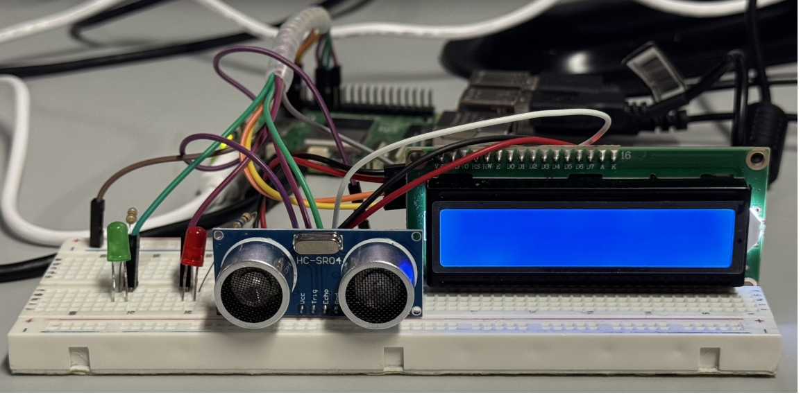
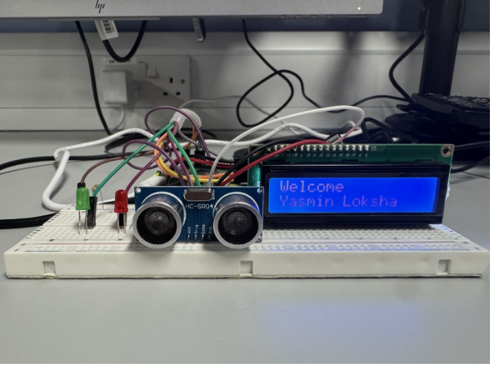
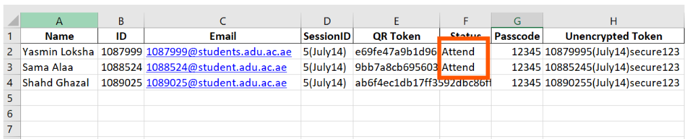

# Secure QR + Face Attendance System

> A Raspberry Pi attendance kiosk that emails each student a personal QR code, then confirms their identity with a face match before logging attendance to Excel.

  

---

## Overview

Manual roll calls and paper sign-ins are slow, error-prone, and easy to cheat (students signing in for absent friends). This project automates attendance with two layers of verification:

1. **Something you have**: a unique QR code emailed to each student shortly before class.
2. **Something you are**: a live face match that must correspond to the owner of the scanned QR code.

An ultrasonic sensor wakes the scanner only when someone is standing close, an LCD and two LEDs give instant feedback, and results are written straight back to an Excel sheet.

Built for **CEN425** at Abu Dhabi University by Yasmin Magdy Loksha, Sama Alaa Mohamed and Shahd Ghazal, supervised by Eng. Gasm El Bary.

## Screenshots

<!-- Replace the placeholders below with real photos / screenshots -->

| Hardware setup | LCD feedback | Excel output |
|---|---|---|
|  |  |  |

## Key Features

- **Personal QR codes by email**: generated and sent automatically one scheduled time before class.
- **Proximity activation**: the HC-SR04 ultrasonic sensor starts scanning only when someone is within 30 cm.
- **Two-factor check-in**: the face seen by the camera must match the student who owns the scanned QR code.
- **Live Excel updates**: matched students are marked `Attend` in the spreadsheet immediately.
- **Instant feedback**: 16x2 I2C LCD messages plus a green LED (accepted) and red LED (rejected).
- **Live attendee counter** shown on the LCD after every successful check-in.
- **Time-boxed sessions**: attendance closes automatically at the end of the window.
- **Error reporting**: runtime errors are displayed on the LCD.

## How It Works

```
Excel roster ──► Email QR codes ──► Student approaches (<30 cm)
                                          │
                                   Scan QR code
                                          │
                              Token found in Excel? ──no──► Red LED, "Invalid QR"
                                          │ yes
                                   Face recognition
                                          │
                       Face == QR owner? ──no──► Red LED, "Face doesn't match"
                                          │ yes
                  Green LED + mark "Attend" in Excel + show total on LCD
```

## Hardware Required

| Component | Notes |
|---|---|
| Raspberry Pi 5 (any Pi with GPIO + USB works) | Raspberry Pi OS with desktop |
| USB webcam | Used for both QR scanning and face recognition |
| HC-SR04 ultrasonic sensor | Trigger → GPIO 17, Echo → GPIO 18 |
| 16x2 LCD with I2C backpack | Address `0x27`, SDA → GPIO 2, SCL → GPIO 3 |
| Green LED | Anode → GPIO 27 (via resistor) |
| Red LED | Anode → GPIO 23 (via resistor) |
| 2x ~1 kΩ resistors, breadboard, jumper wires | |

> **Tip:** the HC-SR04 echo pin outputs 5 V. Use a voltage divider (e.g. 1 kΩ + 2 kΩ) on the echo line to protect the Pi's 3.3 V GPIO.

## Installation

### 1. Clone the repository

```bash
git clone https://github.com/yasminemagdy/secure-qr-face-attendance.git
cd secure-qr-face-attendance
```

### 2. Enable I2C

```bash
sudo raspi-config      # Interface Options → I2C → Enable, then reboot
```

Confirm your LCD shows up (expect `27`):

```bash
sudo apt install -y i2c-tools
i2cdetect -y 1
```

### 3. Install system packages

```bash
sudo apt update
sudo apt install -y python3-pip python3-venv cmake build-essential libzbar0 python3-smbus
```

### 4. Install Python dependencies

```bash
python3 -m venv --system-site-packages venv
source venv/bin/activate
pip install -r requirements.txt
```

> `face_recognition` compiles `dlib` on first install, which can take 10–20 minutes on a Pi. Run it once and grab a coffee.

### 5. Prepare your data

**a) Student roster (Excel `.xlsx`)** with these columns:

| Name | ID | Email | SessionID | Status | QR Token |
|---|---|---|---|---|---|
| Jane Doe | 1000001 | jane@example.com | S1 | | `<token>` |

- `Status` is filled in by the system (`Attend`).
- `QR Token` must be **pre-filled** with a unique value per student. `generate_tokens.py` (step 6) does this for you; it is equivalent to:

  ```python
  import hashlib
  token = hashlib.sha256(f"{student_id}{session_id}{passcode}".encode()).hexdigest()
  ```

  Keep the passcode private to the instructor.

**b) Face photos**: put one clear, front-facing photo per student in a folder. **The filename (without extension) must exactly match the `Name` column**, e.g. `pics/Jane Doe.jpg`.

### 6. Configure

Credentials and paths are read from environment variables (nothing secret lives in the code):

```bash
export SENDER_EMAIL="you@gmail.com"
export SMTP_PASSWORD="your-gmail-app-password"   # https://support.google.com/accounts/answer/185833
export ROSTER_PATH="data/students.xlsx"          # optional, this is the default
export PICS_PATH="pics"                          # optional, this is the default
```

Then edit these in `Attendance.py`:

| Setting | What to change |
|---|---|
| `class_start_time` | Appears **twice** (QR-sending block and main loop); set both to your class start |
| `timedelta(minutes=...)` | How early QRs are emailed, and how long attendance stays open |

To generate the `QR Token` column for your roster:

```bash
python3 generate_tokens.py data/students.xlsx YOUR_PRIVATE_PASSCODE
```

## Usage

```bash
source venv/bin/activate
python3 Attendance.py
```

1. The script waits until the QR-send time, then emails every student their code.
2. When a student steps within 30 cm of the sensor, the LCD shows **Scan QR**.
3. After a valid QR, the LCD greets the student and starts **Face recognition**.
4. On a match, the green LED lights, the Excel file is updated, and the LCD shows the total attendee count.
5. When the attendance window ends, the LCD shows **Attendance Closed** and the program exits.

**Quick 5-minute test:** set `class_start_time` to about 2 minutes from now, use your own email as the only roster row, and add one photo of yourself.

### LCD & LED reference

| Event | LCD | LED |
|---|---|---|
| Waiting for someone | `No Student detected` | none |
| Scanning | `Scan QR` | none |
| Valid QR | `QR Verified` → `Welcome <name>` | none |
| Face accepted | `<name>` / `Attend` → `Total Attendees: N` | Green |
| Invalid QR | `Invalid QR` / `Access Denied` | Red |
| Face mismatch | `Face doesn't match` | Red |
| Window closed | `Time's up` / `Attendance Closed` | none |

## Troubleshooting

| Problem | Fix |
|---|---|
| LCD blank | Run `i2cdetect -y 1`; if the address isn't `0x27`, update `I2C_ADDR`. Adjust the contrast trimmer on the backpack. |
| `Could not open webcam` | Check the camera is on `/dev/video0` and nothing else is using it. |
| Email fails to send | Use a Gmail **App Password** (requires 2-step verification), not your normal password. |
| Face never matches | Use well-lit, front-facing reference photos; confirm filenames match the `Name` column exactly. |
| `ValueError: Excel file must contain...` | Add the missing columns: `Name, ID, Email, SessionID, Status`. |
| Excel not updating | Close the file if it is open in another program. |

## Tech Stack

- **Language:** Python 3
- **Computer vision:** OpenCV (`cv2`), `face_recognition` (dlib), `pyzbar`, NumPy
- **QR generation:** `qrcode`
- **Data handling:** pandas, openpyxl
- **Email:** `smtplib` + `email.mime` (Gmail SMTP)
- **Hardware control:** `gpiozero` (LEDs, ultrasonic sensor), `smbus` (I2C LCD)
- **Platform:** Raspberry Pi 5, Raspberry Pi OS

## Test Results (prototype)

| Test | Result |
|---|---|
| QR generation, emailing and scanning | 100% |
| Proximity sensor activation | 90% (1 miss in 5 trials) |
| Duplicate-scan prevention via face match | 100% |
| Attendance recording and Excel update | 100% |

Tested in a controlled indoor environment; behavior under poor lighting, glasses or masks has not yet been evaluated.

## Known Limitations & Future Work

- Tested only on small rosters in controlled lighting.
- Roster and attendance live in a local Excel file; no cloud sync.
- Planned: mobile app for students and instructors, multi-classroom support, cloud synchronization, additional biometric options.

## Authors

- Yasmin Magdy Loksha
- Sama Alaa Mohamed
- Shahd Ghazal

Supervised by **Eng. Gasm El Bary**, Abu Dhabi University, CEN425.

## License

MIT, see [LICENSE](LICENSE).
